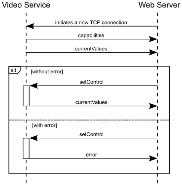

# Video Service
This repository contains the source code of the Video Service, which is part of the [Underwater Camera Project](https://underwater-camera-project.github.io).

## Features

The service provides the following features:

* H.264 video stream (1920 x 1080 pixel)
* MPJPEG video stream (800 x 600 pixel)
* Remote Control Interface for changing the settings of the camera module.

## Installation

The installation of the Video Service consists of two parts: firstly, all the necessary dependencies must be made available, and then the service can be compiled.

### Installing the Dependencies

The following commands can be used to install the required dependencies.

```bash
apt update

apt install git meson pkg-config cmake g++ clang ninja-build \
    libyuv libyaml-dev python3-yaml python3-ply python3-jinja2 \
    git meson pkg-config cmake g++ clang ninja-build libyaml-dev \
    python3-yaml python3-ply python3-jinja2 wget libjpeg-dev

# libcamera
cd
git clone https://git.libcamera.org/libcamera/libcamera.git
cd libcamera
meson setup build
ninja -C build install

# boost
cd
wget https://archives.boost.io/release/1.82.0/source/boost_1_82_0.tar.gz
tar -tf boost_1_82_0.tar.gz
cd boost_1_82_0
``` 

### Compiling the Video Service

The following commands can be used to compile the Video Service:

```bash
cd
git clone https://github.com/tederer/octowatch-videoservice.git
cd octowatch-videoservice
./compile.sh
```

## Starting the Service

In order to start the service, run `start.sh` which is located in the root folder of this project. The following table lists all the environment variables available to customise the behaviour of the service.

## Environment Variables

|variable              |range                               |default        |description                                  |
|----------------------|------------------------------------|---------------|---------------------------------------------|
|OCTOWATCH_LOG_LEVEL   | [DEBUG, INFO, WARNING, ERROR, OFF] | INFO          | log level                                   |
|OCTOWATCH_JPEG_QUALITY| integer in the range [0, 100]      | 95            | JPEG image quality                          |
|OCTOWATCH_JPEG_ENCODER| [CPU, emptyString]                 | emptyString   | whether to use CPU or hardware JPEG encoder   |

## Remote Control Interface

The remote control interface was implemented as a TCP connection. For bidirectional communication, the messages are encoded in JavaScript Object Notation (JSON) format. This is done because the Web Server of the [Underwater Camera Project](https://underwater-camera-project.github.io) is implemented in JavaScript and therefore decoding/parsing of the messages is only necessary in the Video Service. The structure of the messages used is shown in the following listing:

```javascript
{
   "type": string,
   "content": object
}
```

Each message consists of a JSON object with two properties. The "type" specifies the message type and "content" contains the data object that belongs to the message. The following figure shows the communication between the Video Service and a Web Server as a sequence diagram.



The Video Service informs the Web Server about the capabilities of the camera module and their current values as soon as the TCP connection has been established. The following listing shows an abbreviated output of a "capabilities" message. It describes which settings of the camera module can be changed. For each capability, the expected data type, the range in which the value must lie and the default value to be used are specified.

```javascript
{
   "type": "capabilities",
   "content": {
      "Brightness": {
         "type": "float",
         "minimum": -1,
         "maximum": 1,
         "default": 0
      },
      "Contrast": {
         "type": "float",
         "minimum": 0,
         "maximum": 32,
         "default": 1
      },
...
   }
}
```

The "currentValues" message is always sent by the Video Service when the values of the camera properties change. Such a message is shown in the following listing. The capabilities contained in this message and the "capabilities" message depend on the camera module used.

```javascript
{
   "type": " currentValues ",
   "content": {
      "AeConstraintMode": 0,
      "AeExposureMode": 0,
      "AeFlickerMode": 0,
      "AeMeteringMode": 0,
      "AwbMode": 0,
      "Brightness": 0,
      "Contrast": 1,
      "ExposureValue": 0,
      "HdrMode": 0,
      "NoiseReductionMode": 0,
      "Saturation": 1,
      "Sharpness": 1
   }
}
```

If the Web Server receives a request to change the value of a camera module capability, it sends a "setControl" message to the service. This contains information about which property is to be changed and which new value is to be used. An example of such a message that changes the image sharpness is shown in the following listing.

```javascript
{
   "type": "setControl",
   "content": {
      "control": "Sharpness",
      "value": 6
   }
}
```

An error message is sent by the Video Service if an invalid command is received or a problem occurs during processing. The error message is shown in the following listing.

```javascript
{
   "type": "error",
   "content": {
      "message": "unknown command :"
   }
}
```


## References

* [libcamera (open source camera stack)](https://libcamera.org)
* [Video for Linux API (V4L2)](https://www.kernel.org/doc/html/v4.9/media/uapi/v4l/v4l2.html)
* [libjpeg-turbo (JPEG image codec that uses SIMD instructions)](https://www.libjpeg-turbo.org)
* [Boost.Asio (cross-platform C++ library for network and low-level I/O programming)](https://www.boost.org/doc/libs/1_85_0/doc/html/boost_asio.html)
* [Meson (open source build system)](https://mesonbuild.com)
